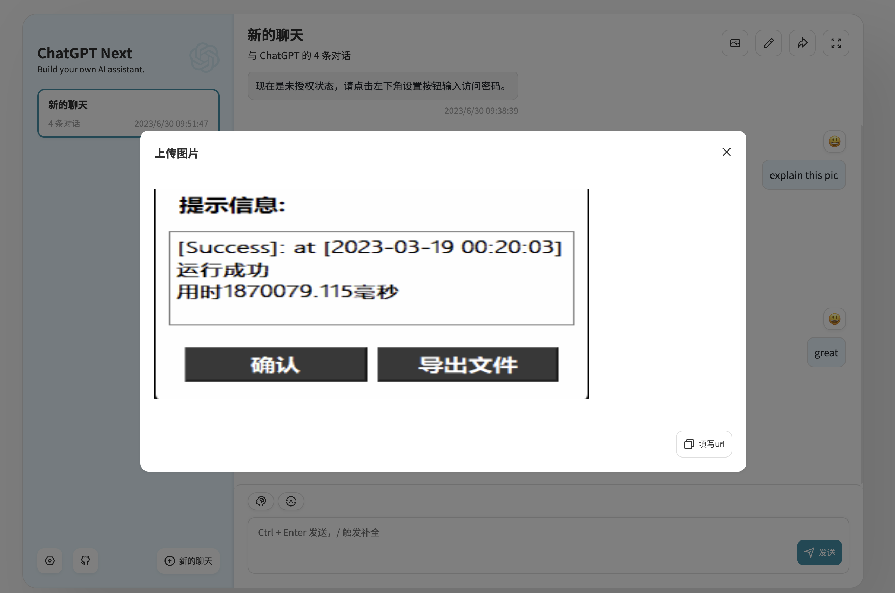
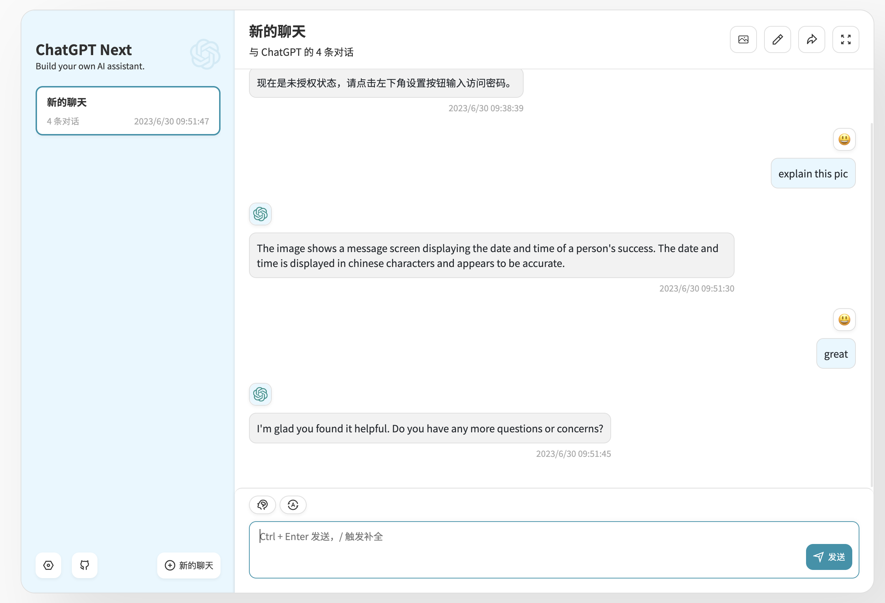

## 一款可以使用多种LM的Chat UI

本项目基于https://github.com/Yidadaa/ChatGPT-Next-Web项目进行改进，深表感谢！

## 目前实现的功能
- 与vicuna server对接
- 改进图形处理页面并与minigpt4 对接

## 后续改进的功能
- 与Triton进行对接，直接使用Triton模型库中的任意模型

## 如何运行
yarn install 
yarn dev